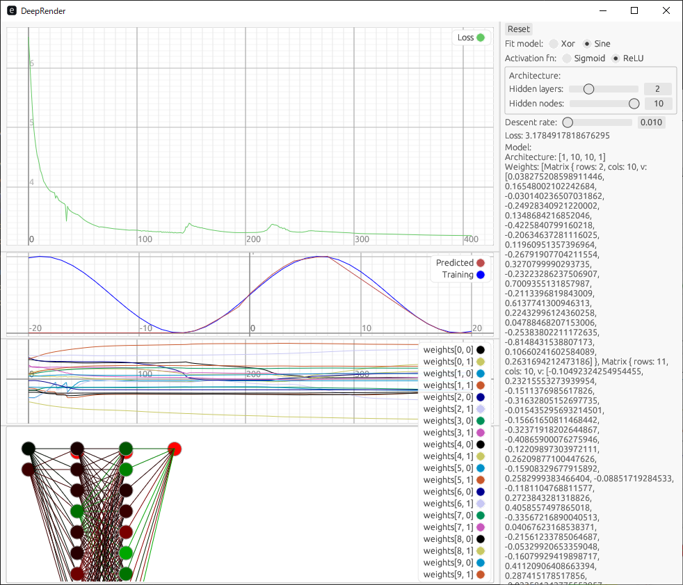

# DeepRender

An experimental Neural Network trainer/visualizer in Rust

# What's this?

This project attempts to implement a neural network trainer and visualizer with a GUI using eframe/egui without using any of the deep learning libraries.
Even the matrix operations are implemented from scratch.
As such, this project is not expected to work efficiently.

There are 2 models to train: a XOR logical gate and a sinusoidal function.

You can switch the model, activation functions, the network architecture and the descent rate in real time.

See [this document](https://github.com/msakuta/typst-test/blob/gh-pages/neural-network.pdf) for more details about the theoretical background.

# How to build

Install [Rust](https://www.rust-lang.org/).

    cargo r
